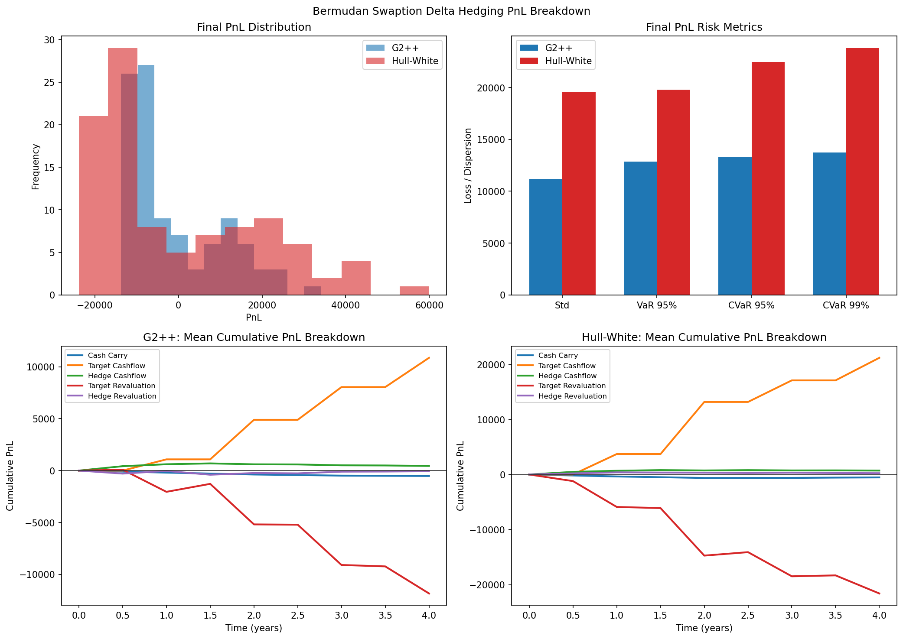
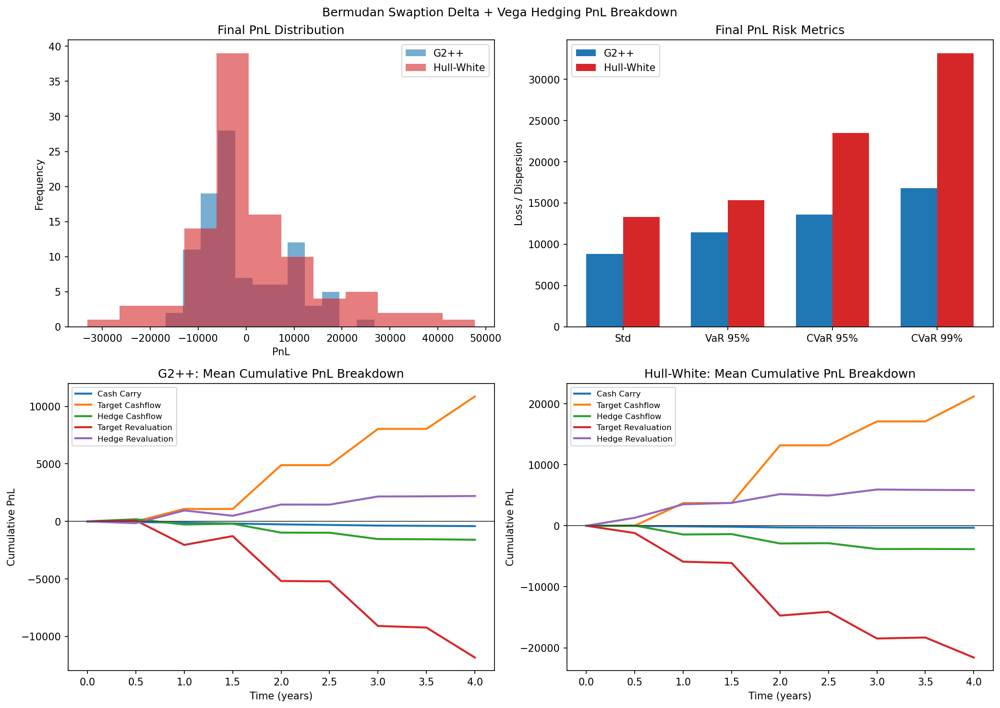

# Rates-Hedging

`rates-hedging` is a compact research codebase for simulating interest-rate models, pricing swaps and swaptions, and studying dynamic hedging of Bermudan swaptions under different model assumptions.

The repository currently focuses on:

- Gaussian short-rate models: Hull-White and G2++
- Interest-rate instruments: swaps, European swaptions, Bermudan swaptions
- Monte Carlo pricing with Longstaff-Schwartz regression for Bermudan exercise
- Pathwise hedging with curve-delta and optional model-vega hedging
- Reproducible experiments that compare hedge PnL across models and hedge sets

## Repository Overview

The main code lives in `src/rateshedging/`:

- `models/`
  - `model.py`: abstract base class for rate models
  - `hull_white.py`: one-factor Hull-White path generation
  - `g2pp.py`: two-factor G2++ path generation
- `instruments/`
  - `instrument.py`: abstract base class for interest-rate instruments
  - `swap.py`: fixed-for-floating swap cashflows and curve-based PV logic
  - `swaption.py`: European swaption exercise and settlement logic
  - `bermudan_swaption.py`: Bermudan swaption exercise schedule and payoff logic
- `pricing/`
  - `curve.py`: zero-rate curve bootstrapping helpers, discounting, forwards
  - `exercise_strategy.py`: abstract base class for exercise strategies
  - `regression.py`: Longstaff-Schwartz regression framework
  - `engine.py`: Monte Carlo pricing engine
- `hedging/`
  - `model_adapters.py`: typed model rebuilders and volatility-bump definitions for vega hedging
  - `engine.py`: dynamic hedging engine with PnL breakdown and residual-risk tracking

Supporting directories:

- `experiments/`: standalone scripts that run hedging studies and write plots/CSV summaries
- `artifacts/`: generated plots and tabular outputs from the experiment scripts
- `tests/`: regression tests for models, pricing, and hedging identities

## Installation

The project targets Python `3.12+`.

```powershell
python -m venv .venv
.venv\Scripts\Activate.ps1
python -m pip install -e .
```

## Running Tests

```powershell
python -m unittest discover -s tests -v
```

## Running Experiments

To run every experiment in sequence:

```powershell
.\run_experiments.ps1
```

This executes:

1. `experiments/compare_bermudan_hedging.py`
2. `experiments/bermudan_delta_pnl_breakdown.py`
3. `experiments/bermudan_delta_vega_pnl_breakdown.py`
4. `experiments/bermudan_model_misspecification_pnl_breakdown.py`

Each script writes plots and CSV summaries into `artifacts/`.

The full batch is computationally heavy. On the current configuration, the delta and delta+vega studies are much slower than the simple model-comparison experiment because they repeatedly reprice Bermudan and European options along many hedge dates.

## Experiment Overview

### 1. Bermudan Hedging: Hull-White vs G2++

`experiments/compare_bermudan_hedging.py` compares Bermudan swaption hedging under a Hull-White-consistent setup and a G2++-consistent setup using curve-delta hedging instruments. It reports final hedge PnL and the average absolute hedge error through time.

Generated files:

- `artifacts/bermudan_hedging_hw_vs_g2pp.png`
- `artifacts/bermudan_hedging_hw_vs_g2pp.csv`


### 2. Delta-Hedging PnL Breakdown

`experiments/bermudan_delta_pnl_breakdown.py` studies Bermudan swaption delta hedging under both models. The script records a pathwise PnL decomposition into:

- cash carry
- target cashflows
- hedge cashflows
- target revaluation
- hedge revaluation

It also reports distributional risk metrics for the final PnL and each PnL component, including:

- mean
- standard deviation
- median
- 95% and 99% loss VaR
- 95% and 99% loss CVaR

Generated files:

- `artifacts/bermudan_delta_pnl_breakdown.png`
- `artifacts/bermudan_delta_pnl_breakdown_paths.csv`
- `artifacts/bermudan_delta_pnl_breakdown_time.csv`
- `artifacts/bermudan_delta_pnl_breakdown_risk.csv`



### 3. Delta + Vega Hedging PnL Breakdown

`experiments/bermudan_delta_vega_pnl_breakdown.py` extends the previous setup by allowing the hedging engine to neutralize both curve-delta and model-vega risk. The hedge set augments the swap hedges with swaptions so that volatility risk can be traded as well.

The same PnL decomposition and distributional risk metrics are produced, which makes it straightforward to compare:

- delta-only vs delta+vega hedging
- Hull-White vs G2++
- central dispersion vs downside tail behavior

Generated files:

- `artifacts/bermudan_delta_vega_pnl_breakdown.png`
- `artifacts/bermudan_delta_vega_pnl_breakdown_paths.csv`
- `artifacts/bermudan_delta_vega_pnl_breakdown_time.csv`
- `artifacts/bermudan_delta_vega_pnl_breakdown_risk.csv`



### 4. Model Misspecification: Hull-White Pricing on G2++ Dynamics

`experiments/bermudan_model_misspecification_pnl_breakdown.py` fixes the realized market dynamics to G2++ paths and compares two desks on the exact same outer scenarios:

- a misspecified desk that prices and hedges with Hull-White
- a correctly specified desk that prices and hedges with G2++

The script keeps the hedge set delta-only so the comparison isolates model misspecification rather than differences in model-vega parameterization. It writes the same pathwise PnL decomposition and risk summaries as the other breakdown studies.

Generated files:

- `artifacts/bermudan_model_misspecification_pnl_breakdown.png`
- `artifacts/bermudan_model_misspecification_pnl_breakdown_paths.csv`
- `artifacts/bermudan_model_misspecification_pnl_breakdown_time.csv`
- `artifacts/bermudan_model_misspecification_pnl_breakdown_risk.csv`

## Current Takeaways

From the current generated artifacts:

- G2++ produces tighter Bermudan hedge PnL distributions than Hull-White in both delta-only and delta+vega studies.
- Adding vega hedging reduces the final PnL standard deviation for both models.
- The delta+vega strategy improves several central and moderate-tail metrics, but not every tail metric in every model, so the full loss distribution should be checked instead of relying on variance alone.
- The hedging engine now records enough information to diagnose whether residual risk comes from curve exposure, volatility exposure, or cashflow/revaluation effects.

## Notes on Modeling Choices

- Yield-curve inputs and outputs use simple continuously compounded zero rates.
- Bermudan pricing uses Monte Carlo simulation with Longstaff-Schwartz continuation-value regression.
- The hedging engine reboots the model from each curve snapshot so option pricing stays consistent with the current term structure.
- Vega hedging is model-parameter vega, not an implied-vol surface hedge.
- Realized swap coupon carry is booked when the rebalance grid matches the coupon accrual grid.
