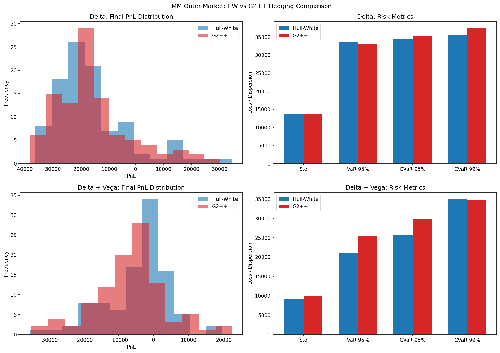
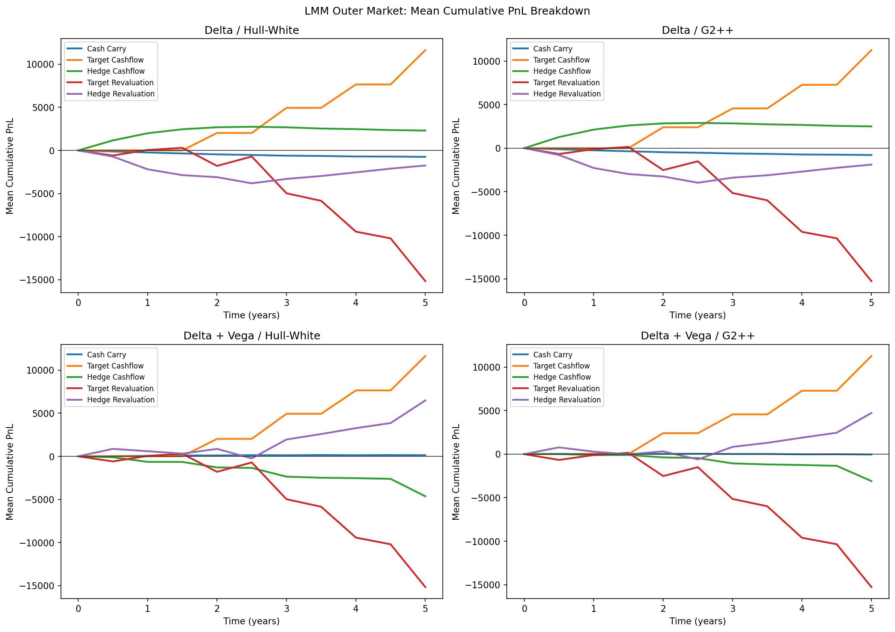

# Rates-Hedging

`rates-hedging` is a compact research codebase for simulating interest-rate models, calibrating desk models to market snapshots, and studying dynamic hedging of Bermudan swaptions under an LMM-driven outer market.

The repository currently focuses on:

- Outer market simulation with a LIBOR Market Model
- Desk pricing and hedging models: Hull-White and G2++
- Calibration of model vol parameters to ATM European swaption surfaces
- Interest-rate instruments: swaps, European swaptions, Bermudan swaptions
- Monte Carlo pricing with Longstaff-Schwartz regression for Bermudan exercise
- Pathwise hedging with curve-delta and optional model-vega hedging
- Snapshot-by-snapshot recalibration to yield-curve and swaption-surface trajectories
- One reproducible experiment that compares hedge PnL across models and hedge sets on the same outer market

## Repository Overview

The main code lives in `src/rateshedging/`:

- `models/`
  - `model.py`: abstract base class for rate models
  - `hull_white.py`: one-factor Hull-White path generation
  - `g2pp.py`: two-factor G2++ path generation
  - `libor_market_model.py`: multi-factor LIBOR Market Model for outer market simulation
- `instruments/`
  - `instrument.py`: abstract base class for interest-rate instruments
  - `swap.py`: fixed-for-floating swap cashflows and curve-based PV logic
  - `swaption.py`: European swaption exercise and settlement logic
  - `bermudan_swaption.py`: Bermudan swaption exercise schedule and payoff logic
- `pricing/`
  - `curve.py`: zero-rate curve bootstrapping helpers, discounting, forwards
  - `exercise_strategy.py`: abstract base class for exercise strategies
  - `regression.py`: Longstaff-Schwartz regression framework
  - `engine.py`: Monte Carlo pricing engine
- `calibration/`
  - `swaption_surface.py`: ATM swaption-surface containers, proxy normal-vol formulas, and surface-path utilities
- `hedging/`
  - `model_adapters.py`: typed model rebuilders, swaption-surface calibration hooks, and volatility-bump definitions for vega hedging
  - `engine.py`: dynamic hedging engine with PnL breakdown, residual-risk tracking, and per-snapshot recalibration

Supporting directories:

- `experiments/`: standalone scripts that run hedging studies and write plots/CSV summaries
- `artifacts/`: generated plots and tabular outputs from the experiment scripts
- `tests/`: regression tests for models, pricing, and hedging identities

## Installation

The project targets Python `3.12+`.

```powershell
python -m venv .venv
.venv\Scripts\Activate.ps1
python -m pip install -e .
```

## Running Tests

```powershell
python -m unittest discover -s tests -v
```

## Running Experiments

To run every experiment in sequence:

```powershell
.\run_experiments.ps1
```

This executes the single end-to-end study:

1. `experiments/lmm_outer_hedging_comparison.py`

The script writes plots and CSV summaries into `artifacts/`.

The experiment is computationally heavy because it repeatedly recalibrates HW and G2++ on each outer market snapshot and then reprices Bermudan and European options along many hedge dates.

## Experiment Overview

### Bermudan Hedging on an LMM Outer Market

`experiments/lmm_outer_hedging_comparison.py` is the single top-level study in the repository.

The experiment uses:

- an outer LIBOR Market Model to generate the yield-curve trajectory
- an LMM-implied ATM swaption-surface trajectory generated from the same outer forward-rate state
- an inner Monte Carlo pricing loop in which the desk recalibrates either Hull-White or G2++ at every hedge date
- two hedge sets on the exact same outer market paths:
  - delta-only
  - delta+vega

This makes the comparison internally coherent:

- the market is the same for every desk and hedge set
- the desk models are compared on identical outer scenarios
- the impact of adding vega hedges is evaluated on the same paths rather than across different experiments

Generated files:

- `artifacts/lmm_outer_hedging_comparison_overview.png`
- `artifacts/lmm_outer_hedging_comparison_breakdown.png`
- `artifacts/lmm_outer_hedging_comparison_paths.csv`
- `artifacts/lmm_outer_hedging_comparison_time.csv`
- `artifacts/lmm_outer_hedging_comparison_risk.csv`

### Resulting Plots

Overview of the final PnL distributions and headline risk metrics:



Mean cumulative PnL breakdown across hedge dates:



## Current Takeaways

From the current generated artifacts:

- delta+vega hedging improves the mean PnL, standard deviation, and 95% VaR for both desk models relative to delta-only hedging on the same LMM paths
- G2++ fits the outer market surface more closely than Hull-White, reflected in lower calibration RMSE
- under the current true-LMM ATM surface setup, G2++ outperforms Hull-White on the main mean / dispersion / 95% tail metrics for both hedge sets
- the experiment outputs enough diagnostics to separate calibration quality, residual curve risk, residual vega risk, and PnL decomposition effects

## Notes on Modeling Choices

- Yield-curve inputs and outputs use simple continuously compounded zero rates.
- Calibration uses ATM European swaption normal-vol surfaces on a small expiry/tenor grid.
- Mean-reversion and correlation are treated as structural inputs; the calibration step fits the model volatility parameters to the surface at each hedge date.
- Bermudan pricing uses Monte Carlo simulation with Longstaff-Schwartz continuation-value regression.
- The hedging engine reboots and recalibrates the model from each curve-plus-surface snapshot so option pricing stays consistent with the current market state.
- Vega hedging is model-parameter vega, not an implied-vol surface hedge.
- Realized swap coupon carry is booked when the rebalance grid matches the coupon accrual grid.
